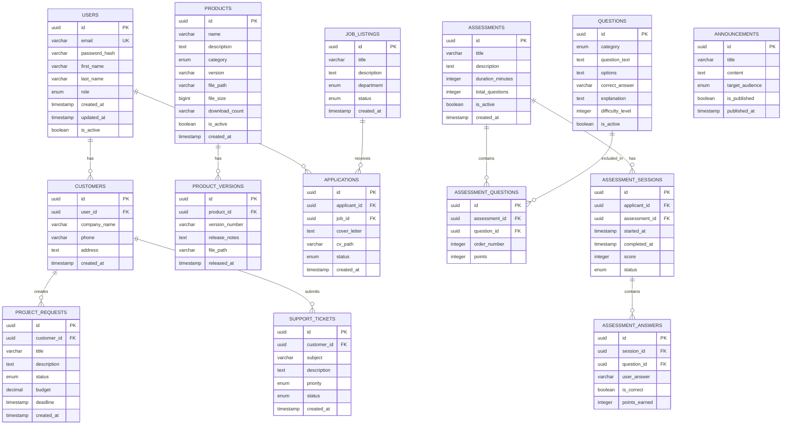

# N.O.U Digital Systems - Technical Specification

## 1. System Architecture

### 1.1 High-Level Architecture
The platform follows a modern three-tier architecture with clear separation of concerns:

```
┌─────────────────────────────────────────────────────────────┐
│                     PRESENTATION LAYER                       │
│  React.js + TypeScript + Tailwind CSS                       │
│  • Customer Portal                                          │
│  • Employment Portal                                        │
│  • Administration Portal                                    │
└─────────────────────────────────────────────────────────────┘
                              │
                              ▼
┌─────────────────────────────────────────────────────────────┐
│                     APPLICATION LAYER                        │
│  FastAPI (Python 3.10+)                                     │
│  • RESTful API Endpoints                                    │
│  • Business Logic                                           │
│  • Authentication & Authorization                           │
│  • File Processing                                          │
│  • Assessment Engine                                        │
└─────────────────────────────────────────────────────────────┘
                              │
                              ▼
┌─────────────────────────────────────────────────────────────┐
│                       DATA LAYER                            │
│  PostgreSQL 14+ with SQLAlchemy ORM                         │
│  • User Management                                          │
│  • Product Catalog                                          │
│  • Assessment System                                        │
│  • File Storage (Local/Cloud)                               │
└─────────────────────────────────────────────────────────────┘
```

### 1.2 Technology Choices & Modern Alternatives

#### Frontend Alternatives Considered:
1. **React.js + TypeScript** (Selected)
   - Pros: Large ecosystem, excellent TypeScript support, component-based
   - Cons: Steeper learning curve than vanilla JS
   
2. **Next.js** (Alternative)
   - Pros: SSR/SSG, better SEO, API routes
   - Cons: Overkill for SPA, more complex deployment
   
3. **Vue.js + TypeScript** (Alternative)
   - Pros: Gentler learning curve, excellent documentation
   - Cons: Smaller ecosystem than React

**Decision**: React.js with TypeScript for maximum flexibility and ecosystem support.

#### Backend Alternatives Considered:
1. **FastAPI** (Selected)
   - Pros: High performance, automatic API docs, async support
   - Cons: Newer framework, smaller community than Django
   
2. **Django + DRF** (Alternative)
   - Pros: Mature, built-in admin, large community
   - Cons: Heavier, less performant for APIs
   
3. **Node.js + Express** (Alternative)
   - Pros: JavaScript everywhere, fast development
   - Cons: Callback hell, less structured

**Decision**: FastAPI for performance, modern async patterns, and excellent developer experience.

#### Database Alternatives Considered:
1. **PostgreSQL** (Selected)
   - Pros: ACID compliant, JSON support, full-text search
   - Cons: More complex setup than SQLite
   
2. **MySQL** (Alternative)
   - Pros: Widely used, good performance
   - Cons: Less feature-rich than PostgreSQL
   
3. **MongoDB** (Alternative)
   - Pros: Flexible schema, good for documents
   - Cons: Not ideal for relational data

**Decision**: PostgreSQL for reliability, advanced features, and JSON support.

## 2. Database Design

### 2.1 Entity Relationship Diagram



### 2.2 Database Schema Details

#### Users Table
```sql
CREATE EXTENSION IF NOT EXISTS "uuid-ossp";

CREATE TABLE users (
    id UUID PRIMARY KEY DEFAULT uuid_generate_v4(),
    email VARCHAR(255) UNIQUE NOT NULL,
    password_hash VARCHAR(255) NOT NULL,
    first_name VARCHAR(100) NOT NULL,
    last_name VARCHAR(100) NOT NULL,
    role VARCHAR(20) NOT NULL CHECK (role IN ('visitor', 'customer', 'applicant', 'admin')),
    is_active BOOLEAN DEFAULT TRUE,
    created_at TIMESTAMP WITH TIME ZONE DEFAULT CURRENT_TIMESTAMP,
    updated_at TIMESTAMP WITH TIME ZONE DEFAULT CURRENT_TIMESTAMP
);

CREATE INDEX idx_users_email ON users(email);
CREATE INDEX idx_users_role ON users(role);
```

#### Products Table
```sql
CREATE TABLE products (
    id UUID PRIMARY KEY DEFAULT uuid_generate_v4(),
    name VARCHAR(255) NOT NULL,
    description TEXT,
    category VARCHAR(50) NOT NULL,
    version VARCHAR(50) NOT NULL,
    file_path VARCHAR(500),
    file_size BIGINT,
    download_count INTEGER DEFAULT 0,
    is_active BOOLEAN DEFAULT TRUE,
    created_at TIMESTAMP WITH TIME ZONE DEFAULT CURRENT_TIMESTAMP
);

CREATE INDEX idx_products_category ON products(category);
CREATE INDEX idx_products_active ON products(is_active);
```

## 3. API Specification

### 3.1 Authentication Endpoints

```yaml
POST /api/v1/auth/register
  Description: Register new user
  Request Body:
    email: string (required)
    password: string (required, min 8 chars)
    first_name: string (required)
    last_name: string (required)
    role: enum ('customer', 'applicant')
  Response: 201 Created
    user: User object
    token: JWT token

POST /api/v1/auth/login
  Description: User login
  Request Body:
    email: string (required)
    password: string (required)
  Response: 200 OK
    user: User object
    token: JWT token

POST /api/v1/auth/refresh
  Description: Refresh JWT token
  Headers: Authorization: Bearer <token>
  Response: 200 OK
    token: New JWT token

POST /api/v1/auth/logout
  Description: User logout
  Headers: Authorization: Bearer <token>
  Response: 200 OK
```

### 3.2 Company Portal Endpoints

```yaml
GET /api/v1/company/info
  Description: Get company information
  Response: 200 OK
    company: CompanyInfo object

GET /api/v1/company/portfolio
  Description: Get company portfolio
  Response: 200 OK
    projects: [Project]

GET /api/v1/company/announcements
  Description: Get published announcements
  Query: page, limit
  Response: 200 OK
    announcements: [Announcement]
    pagination: Pagination object
```

### 3.3 Product Management Endpoints

```yaml
GET /api/v1/products
  Description: List all products
  Query: category, search, page, limit
  Response: 200 OK
    products: [Product]
    pagination: Pagination object

GET /api/v1/products/{id}
  Description: Get product details
  Response: 200 OK
    product: Product object
    versions: [ProductVersion]

GET /api/v1/products/{id}/download
  Description: Download product file
  Response: 200 OK
    File stream

POST /api/v1/admin/products
  Description: Create new product (Admin only)
  Headers: Authorization: Bearer <admin_token>
  Request Body: Product creation data
  Response: 201 Created
    product: Product object
```

### 3.4 Employment Module Endpoints

```yaml
GET /api/v1/jobs
  Description: List available job listings
  Query: department, status
  Response: 200 OK
    jobs: [JobListing]

POST /api/v1/applications
  Description: Submit job application
  Headers: Authorization: Bearer <token>
  Request Body: Application data + CV file
  Response: 201 Created
    application: Application object

GET /api/v1/applications/me
  Description: Get user's applications
  Headers: Authorization: Bearer <token>
  Response: 200 OK
    applications: [Application]
```

### 3.5 Technical Assessment Endpoints

```yaml
GET /api/v1/assessments
  Description: List available assessments
  Headers: Authorization: Bearer <token>
  Response: 200 OK
    assessments: [Assessment]

POST /api/v1/assessments/{id}/start
  Description: Start assessment session
  Headers: Authorization: Bearer <token>
  Response: 201 Created
    session: AssessmentSession
    questions: [Question] (without answers)

POST /api/v1/assessments/sessions/{session_id}/submit
  Description: Submit assessment answers
  Headers: Authorization: Bearer <token>
  Request Body: Answers array
  Response: 200 OK
    result: AssessmentResult
    score: integer
    rank: integer
```

### 3.6 Support Module Endpoints

```yaml
POST /api/v1/support/tickets
  Description: Create support ticket
  Headers: Authorization: Bearer <token>
  Request Body: Ticket data
  Response: 201 Created
    ticket: SupportTicket

GET /api/v1/support/tickets/me
  Description: Get user's support tickets
  Headers: Authorization: Bearer <token>
  Response: 200 OK
    tickets: [SupportTicket]

POST /api/v1/support/tickets/{id}/reply
  Description: Reply to support ticket
  Headers: Authorization: Bearer <token>
  Request Body: Reply content
  Response: 200 OK
    reply: TicketReply
```

## 4. Frontend Architecture

### 4.1 Component Structure

```
src/
├── components/
│   ├── common/
│   │   ├── Button.tsx
│   │   ├── Card.tsx
│   │   ├── Modal.tsx
│   │   ├── Input.tsx
│   │   └── Layout.tsx
│   ├── customer/
│   │   ├── ProductCard.tsx
│   │   ├── DownloadButton.tsx
│   │   └── SupportForm.tsx
│   ├── employment/
│   │   ├── JobCard.tsx
│   │   ├── ApplicationForm.tsx
│   │   └── AssessmentPlayer.tsx
│   └── admin/
│       ├── ProductManager.tsx
│       ├── UserManager.tsx
│       └── ReportGenerator.tsx
├── pages/
│   ├── public/
│   │   ├── HomePage.tsx
│   │   ├── ProductsPage.tsx
│   │   └── CareersPage.tsx
│   ├── customer/
│   │   ├── Dashboard.tsx
│   │   ├── Downloads.tsx
│   │   └── Support.tsx
│   ├── applicant/
│   │   ├── Dashboard.tsx
│   │   ├── Applications.tsx
│   │   └── Assessment.tsx
│   └── admin/
│       ├── Dashboard.tsx
│       ├── Products.tsx
│       ├── Users.tsx
│       └── Reports.tsx
├── hooks/
│   ├── useAuth.ts
│   ├── useProducts.ts
│   └── useAssessment.ts
├── services/
│   ├── api.ts
│   ├── authService.ts
│   └── assessmentService.ts
├── store/
│   ├── index.ts
│   ├── authSlice.ts
│   └── productSlice.ts
└── utils/
    ├── helpers.ts
    └── validators.ts
```

### 4.2 Routing Structure

```typescript
const routes = {
  // Public routes
  '/': HomePage,
  '/products': ProductsPage,
  '/careers': CareersPage,
  '/login': LoginPage,
  '/register': RegisterPage,
  
  // Customer routes
  '/customer/dashboard': CustomerDashboard,
  '/customer/downloads': CustomerDownloads,
  '/customer/support': CustomerSupport,
  '/customer/projects': CustomerProjects,
  
  // Applicant routes
  '/applicant/dashboard': ApplicantDashboard,
  '/applicant/applications': ApplicantApplications,
  '/applicant/assessment/:id': AssessmentPage,
  '/applicant/results': AssessmentResults,
  
  // Admin routes
  '/admin/dashboard': AdminDashboard,
  '/admin/products': ProductManagement,
  '/admin/users': UserManagement,
  '/admin/assessments': AssessmentManagement,
  '/admin/reports': ReportsPage,
};
```

## 5. Security Implementation

### 5.1 Authentication & Authorization

```python
# JWT Configuration
JWT_SECRET_KEY = "your-secret-key"
JWT_ALGORITHM = "HS256"
JWT_EXPIRATION_MINUTES = 30
REFRESH_TOKEN_EXPIRATION_DAYS = 7

# Role-Based Access Control
ROLES = {
    'visitor': ['read:company_info', 'read:products'],
    'customer': [
        'read:products', 'download:products',
        'create:support_tickets', 'create:project_requests'
    ],
    'applicant': [
        'read:jobs', 'create:applications',
        'take:assessments', 'read:results'
    ],
    'admin': ['*']  # Full access
}
```

### 5.2 Security Measures

1. **Password Hashing**: bcrypt with salt rounds
2. **Input Validation**: Pydantic models for API validation
3. **SQL Injection Prevention**: SQLAlchemy ORM parameterized queries
4. **XSS Protection**: React's built-in escaping + Content Security Policy
5. **CSRF Protection**: SameSite cookies + CSRF tokens
6. **Rate Limiting**: FastAPI middleware with Redis
7. **File Upload Security**: 
   - File type validation
   - Size limits (10MB max)
   - Virus scanning (optional)
   - Randomized file names
8. **HTTPS**: SSL/TLS encryption in production
9. **Audit Logging**: All critical operations logged

## 6. Deployment Strategy

### 6.1 Docker Configuration

```yaml
# docker-compose.yml
version: '3.8'

services:
  frontend:
    build: ./frontend
    ports:
      - "3000:3000"
    depends_on:
      - backend
    
  backend:
    build: ./backend
    ports:
      - "8000:8000"
    environment:
      - DATABASE_URL=postgresql://user:pass@db:5432/nou_db
      - JWT_SECRET=${JWT_SECRET}
    depends_on:
      - db
    
  db:
    image: postgres:14-alpine
    environment:
      - POSTGRES_USER=user
      - POSTGRES_PASSWORD=pass
      - POSTGRES_DB=nou_db
    volumes:
      - postgres_data:/var/lib/postgresql/data
    
  nginx:
    image: nginx:alpine
    ports:
      - "80:80"
      - "443:443"
    volumes:
      - ./nginx.conf:/etc/nginx/nginx.conf
      - ./ssl:/etc/nginx/ssl
    depends_on:
      - frontend
      - backend

volumes:
  postgres_data:
```

### 6.2 CI/CD Pipeline

```yaml
# .github/workflows/ci.yml
name: CI/CD Pipeline

on:
  push:
    branches: [main, develop]
  pull_request:
    branches: [main]

jobs:
  test:
    runs-on: ubuntu-latest
    steps:
      - uses: actions/checkout@v3
      - name: Set up Python
        uses: actions/setup-python@v4
        with:
          python-version: '3.10'
      - name: Install dependencies
        run: |
          pip install -r requirements.txt
      - name: Run tests
        run: pytest

  deploy:
    needs: test
    if: github.ref == 'refs/heads/main'
    runs-on: ubuntu-latest
    steps:
      - name: Deploy to production
        run: |
          # Deployment commands here
```

## 7. Performance Optimization

### 7.1 Frontend Optimization
- Code splitting with React.lazy
- Image optimization with WebP format
- Service Worker for offline capability
- CDN for static assets
- Bundle analysis and tree shaking

### 7.2 Backend Optimization
- Database connection pooling
- Redis caching for frequently accessed data
- Async/await for non-blocking operations
- Pagination for all list endpoints
- Database query optimization with indexes

### 7.3 Database Optimization
- Proper indexing strategy
- Query performance monitoring
- Regular vacuum and analyze
- Partitioning for large tables
- Read replicas for scaling

## 8. Monitoring & Logging

### 8.1 Application Monitoring
- Health check endpoints
- Performance metrics collection
- Error tracking with Sentry
- Uptime monitoring

### 8.2 Logging Strategy
- Structured logging with JSON
- Log levels: DEBUG, INFO, WARNING, ERROR, CRITICAL
- Centralized log aggregation
- Audit logging for security events

## 9. Testing Strategy

### 9.1 Testing Levels
1. **Unit Tests**: Individual components and functions
2. **Integration Tests**: API endpoints and database operations
3. **E2E Tests**: Complete user workflows
4. **Performance Tests**: Load and stress testing
5. **Security Tests**: Vulnerability scanning

### 9.2 Testing Tools
- **Backend**: pytest, httpx, factory_boy
- **Frontend**: Jest, React Testing Library, Cypress
- **API**: Postman, Newman
- **Performance**: Locust, k6

## 10. Documentation

### 10.1 API Documentation
- Auto-generated with FastAPI (Swagger UI)
- Postman collection for testing
- Code examples for common operations

### 10.2 User Documentation
- Customer user guide
- Applicant user guide
- Administrator user guide
- FAQ section

### 10.3 Developer Documentation
- Setup guide
- Architecture overview
- Contributing guidelines
- Code style guide